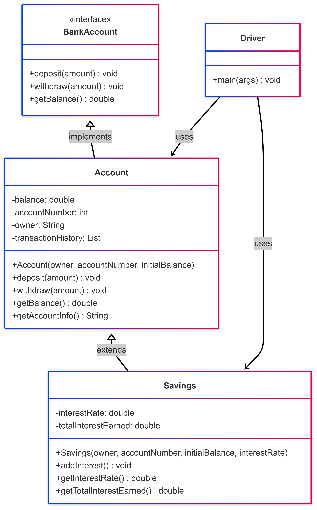

# BankLedger

A clean, object-oriented Java banking simulator that mirrors real-world financial behavior through **depositing, withdrawing, and earning interest**. Designed for clarity, modularity, and professional demonstration.

---

## Overview

- **Author:** Omar Hernandez
- **Date:** December 8th, 2024
- **Language:** Java 17 (Maven-based project)

BankLedger simulates **basic checking and savings accounts**, showcasing practical software engineering techniques such as:

- Encapsulation of financial data
- Inheritance through a `Savings` account subclass
- Transaction logging and balance tracking

---

## Financial Analogy

Imagine two real clients at a bank:

- **Alex Developer** has a standard checking account.
- **Jordan Engineer** uses a savings account that earns interest.

This program tracks their financial activities:

- Deposits and withdrawals
- Account summaries
- Interest earned over time (only for savings)

Think of it as **a digital ledger**, but built in Java.

---

## Core Features

- **Modular OOP Design:** Separate classes for account types
- **Live Ledger History:** Tracks every transaction
- **Interest Engine:** Automatically computes & applies savings interest
- **Readable CLI Output:** Clear summary and history for each user

---

## Architecture Diagram (UML)

> **Mobile Friendly:** Embedded as image instead of Mermaid for full compatibility
> 📂 `./bankledger.png`



---

## Compile & Run

### Run via Maven

```bash
mvn compile
mvn exec:java -Dexec.mainClass="com.omar.bankledger.Driver"
```

### Or Run Manually (Java 17)

```bash
javac src/main/java/com/omar/bankledger/*.java
java -cp src/main/java com.omar.bankledger.Driver
```

---

## Sample Output

```
=== Final Account Summary ===

Account Owner: Alex Developer
Account Number: 1001
Account Balance: $7258.83

Transaction History:
Account created with balance: $6922.83
Deposited: $461.0
Withdrew: $125.0

-----------------------------

Account Owner: Jordan Engineer
Account Number: 2002
Account Balance: $3103.28
Interest Rate: 1.15%
Total Interest Earned: $35.28

Transaction History:
Account created with balance: $1328.0
Deposited: $881.0
Withdrew: $341.0
Deposited: $1200.0
Deposited: $35.282
Interest credited: $35.28
```

---

## Unit Testing

Basic tests are written in `BankLedgerTest.java` using **JUnit 5** to validate:

- Valid deposits and withdrawals
- Proper interest calculation
- Handling of invalid or edge-case transactions

### Run Tests

```bash
mvn test
```

---

## Project Structure

```
BankLedger/
├── README.md
├── bankledger.png
├── image/
│   └── README
├── pom.xml
├── src/
│   ├── main/
│   │   └── java/
│   │       └── com/omar/bankledger/
│   │           ├── Account.java
│   │           ├── Driver.java
│   │           └── Savings.java
│   └── test/
│       └── java/
│           └── com/omar/bankledger/
│               └── BankLedgerTest.java
├── .vscode/
│   ├── settings.json
│   ├── tasks.json
│   ├── launch.json
│   └── java-formatter.xml
└── .github/
    └── workflows/
        └── maven.yml
```

---

## Future Enhancements

- Time-based interest compounding
- CSV export for statements
- GUI interface with JavaFX or Swing
- Support for multiple or joint accounts

---


## Contact

<p align="center">
  <a href="mailto:ohern@bu.edu">
    
  </a>
  <a href="https://github.com/oohmxi">
    
  </a>
  <a href="https://linkedin.com/in/omarhlink">
    
  </a>
</p>

<p align="center"><em>Built with ❤️ by Omar Hernandez</em></p>
