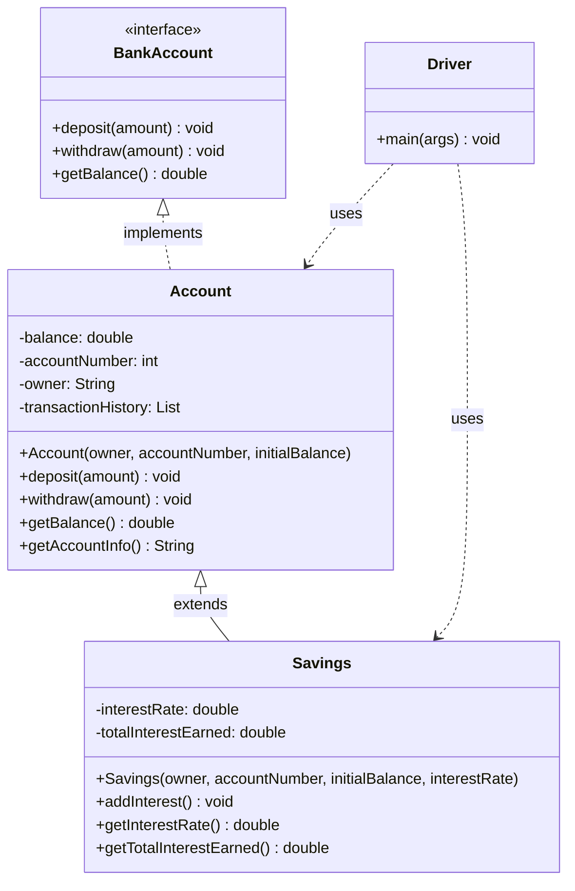

# 🏦 BankLedger

A Java-based banking simulation project that demonstrates object-oriented programming principles such as encapsulation, inheritance, and polymorphism.

## 📌 Project Info

- **Author:** Omar Hernandez
- **Date:** December 8th, 2024
- **Language:** Java 17
- **Files:**
  - `Account.java` – Base account class
  - `Savings.java` – Inherits from `Account`, adds interest logic
  - `Driver.java` – Main driver with transaction simulation

## 💡 Features

- Modular class design using inheritance
- Simulates deposits, withdrawals, and balance updates
- Console input/output interaction


## 📊 Class Diagram

The project follows this object-oriented structure:




## 🧪 Compile & Run (Java 17)

```bash
javac Account.java Savings.java Driver.java
java Driver
```

## 🔎 Example Output

```text
=== Final Account Summary ===

Account Owner: Alice Customer  
Account Number: 10001  
Account Balance: $7258.83  

Transaction History:  
Account created with balance: $6922.83  
Deposited: $461.0  
Withdrew: $125.0  

-----------------------------

Account Owner: Bob Saver  
Account Number: 10002  
Account Balance: $3076.22  
Interest Rate: 1.15%  
Total Interest Earned: $39.22  

Transaction History:  
Account created with balance: $1328.0  
Deposited: $881.0  
Withdrew: $341.0  
Deposited: $1200.0  
Interest credited: $39.22  
```
