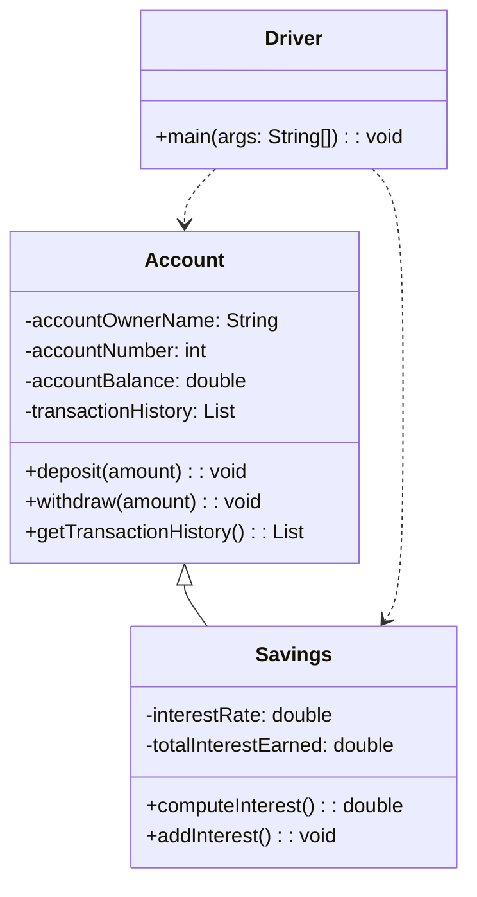

# 🏦 BankLedger

A clean, object-oriented Java banking simulator that mirrors real-world financial behavior through **depositing, withdrawing, and earning interest**. Designed for clarity, modularity, and professional demonstration.

---

## 📌 Overview

- **Author:** Omar Hernandez
- **Date:** December 8th, 2024
- **Language:** Java 17 (Maven-based project)

BankLedger simulates **basic checking and savings accounts**, showcasing practical software engineering techniques such as:

- Encapsulation of financial data
- Inheritance through a `Savings` account subclass
- Transaction logging and balance tracking

---

## 💸 Financial Analogy

Imagine two real clients at a bank:

- **Alex Developer** has a standard checking account.
- **Jordan Engineer** uses a savings account that earns interest.

This program tracks their financial activities:

- Deposits and withdrawals
- Account summaries
- Interest earned over time (only for savings)

Think of it as **a digital ledger**, but built in Java.

---

## 💡 Core Features

- ✅ **Modular OOP Design:** Separate classes for account types
- ✅ **Live Ledger History:** Tracks every transaction
- ✅ **Interest Engine:** Automatically computes & applies savings interest
- ✅ **Readable CLI Output:** Clear summary and history for each user

---

## 📊 Architecture Diagram (UML)



---

## 🧪 Compile & Run

### ▶️ Run via Maven

```bash
mvn compile
mvn exec:java -Dexec.mainClass="com.omar.bankledger.Driver"
```

### Or Run Manually (Java 17)

```bash
javac src/main/java/com/omar/bankledger/*.java
java -cp src/main/java com.omar.bankledger.Driver
```

---

## 🔍 Sample Output

```
=== Final Account Summary ===

Account Owner: Alex Developer
Account Number: 1001
Account Balance: $7258.83

Transaction History:
Account created with balance: $6922.83
Deposited: $461.0
Withdrew: $125.0

-----------------------------

Account Owner: Jordan Engineer
Account Number: 2002
Account Balance: $3103.28
Interest Rate: 1.15%
Total Interest Earned: $35.28

Transaction History:
Account created with balance: $1328.0
Deposited: $881.0
Withdrew: $341.0
Deposited: $1200.0
Deposited: $35.282
Interest credited: $35.28
```

---

## 🧪 Unit Testing

Basic tests are written in `BankLedgerTest.java` using **JUnit 5** to validate:

- ✅ Valid deposits and withdrawals
- ✅ Proper interest calculation
- ✅ Handling of invalid or edge-case transactions

### ▶️ Run Tests

```bash
mvn test
```

---

## 📁 Project Structure

```
BankLedger/
├── README.md
├── pom.xml
├── .gitignore
├── src
│   ├── main/java/com/omar/bankledger
│   │   ├── Account.java
│   │   ├── Savings.java
│   │   └── Driver.java
│   └── test/java/com/omar/bankledger
│       └── BankLedgerTest.java
```

---

## 🚀 Future Enhancements

- ⏳ Time-based interest compounding
- 🧾 CSV export for statements
- 🖥️ GUI interface with JavaFX or Swing
- 🏦 Support for multiple or joint accounts

---

## git status👨‍💻 Contact

*Built with ❤️ by Omar Hernandez*

📧 Email: [`ohern@bu.edu`](mailto:ohern@bu.edu)
🐙 GitHub: [@oohmxi](https://github.com/oohmxi)
🔗 LinkedIn: [linkedin.com/in/omarhlink](https://www.linkedin.com/in/omarhlink/)
